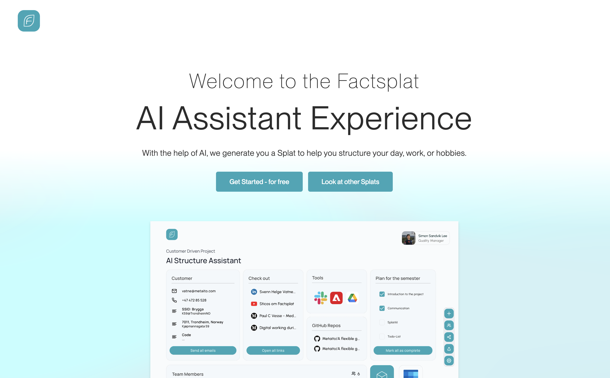

<h1 align="center">Factsplat AI Assistant</h1>

<p align="center">
 <a href="#pre">Technologies</a> •
 <a href="#description">Description</a> •
 <a href="#started">Getting Started</a> •
 <a href="#more-docs">More documentation</a>
</p>

<p align="center">
    
    <b>Try it out here: <a href="https://cdp-group-4-metaito-2024.vercel.app/">Vercel</a></b>
 ---
    <b>The Factsplat AI Assistant is a RAG model to help you get started!</b>
</p>

<h2 id="pre">Prerequisites</h2>
<h3>App</h3>

<a href="https://nextjs.org/">NextJS</a><br/>
<a href="https://tailwindcss.com/">TailwindCSS</a><br/>

<h3>Env Variables</h3>

To run this project you will need the API keys for OpenAI and Supabase. If you are a sensor of the project, you should've been provided this beforehand. If not, please contact the project owner. You will find more information about this in the environmental variables section under the [Getting Started](#started) section.

<h2 id="description">Description</h2>

The Factsplat AI Assistant is a project made under the Customer Driven Project at NTNU [TDT4290](https://www.ntnu.no/studier/emner/TDT4290#tab=omEmnet/). The main goal of the project was to create an AI assistant that could help the customers of Factsplat getting started and easily acheive a "goal oriented approach". This means less clutter and more fun when sorting out your day, hobbies or work. The app consists of three main parts:
 - A landing page to show off other splats
 - A AI integrated form to ask more specific questions related to the splats use case
 - A newly designed functional mock of Factsplat, designed with users in mind

 To read more about how the project works, please go to the [More documentation](#more-docs) section.

<h2 id="started">🚀 Getting started</h2>
To get started running the Factsplat AI Assistant, follow the steps below.

<h3>Cloning</h3>
First we have to clone the project.
Write this in your terminal:

```bash
git clone https://github.com/havarhagelund/cdp-group-4-metaito-2024.git
```

<h3 id="env-variables">Setting up the environment</h3>
Now we have to set up the environment variables. If you are a sensor of the project you will find these in the Appendix.
Create a .env file in the root of the project and add the following:

```bash
OPENAI_API_KEY=YOUR_OPENAI_API_KEY
NEXT_PUBLIC_SUPABASE_URL=YOUR_SUPABASE_URL
NEXT_PUBLIC_SUPABASE_ANON_KEY=YOUR_SUPABASE_ANON_KEY
```

<h3>Starting</h3>
Now we have to start the project itself.
Run the following commands:

```bash
cd fs-ai-assistant-frontend
npm install
npm run dev
```

Now the application should be running at localhost:3000

<h3>Building</h3>
Before pushing changes, make sure to run the following commands:

```bash
npm run lint
npm run prettier
npm run build
```

This will ensure that the code is properly formatted and that the build is successful.

<h3>Testing</h3>
The project consists of two main types of testing, E2E and Unit testing.
To run the different tests, run the following command:

Unit Testing:

```bash
npm run test
```

For the E2E testing you will need to have two terminals open, one for running the application and one for running the tests.

E2E Testing:
```bash
npm run dev
npm run cypress:open
```

<h2 id="more-docs">More documentation</h2>
The project consists of quite a lot of documentation, both internal and external. To read some of the internal documentation, we recommend reading the grid.ts file, as this includes a lot of functionality for the mock.
As of external documentation, we have split them into five main sections in the docs folder:

- [How does the Splat Mock work?](docs/SplatMock.md)
- [How does the AI Form work?](docs/Form.md)
- [Packages & Dependencies](docs/Dependencies.md)
- [Project Structure](docs/Structure.md)
- [How to test](docs/Testing.md)
